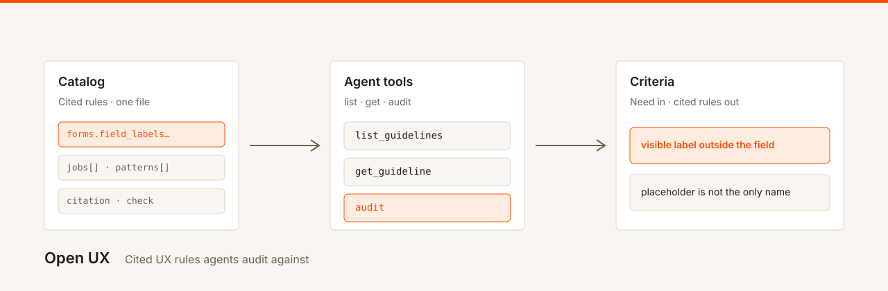

# Open UX



**Cited UX rules agents audit against.**

Stop inventing UX rules from memory. Open UX is a shared, cited catalog agents list, fetch, and audit against. v1: Forms → field labels. Register for a key on the hosted service; self-host without our cloud. Telemetry improves the shared catalog — we never store your UI payloads.

## What it is

A small, machine-readable store of UX guidelines plus tools so an agent can:

1. **List** the current rules
2. **Fetch** a full cited rule
3. **Audit** a UI snippet and get structured `pass` / `fail` / `incomplete` with rule ids

Audits are **hybrid**. Where a rule is checkable and the input is parseable HTML or JSX, the **server** grades it deterministically. Where it isn’t, the server returns `incomplete` plus the rule text (`pass_when` / `fail_when`) so the **client LLM** can finish. There is no server-side LLM.

Use the hosted endpoint (register with email, get an API key) or self-host the same catalog and tools. Open source, MIT.

## What it isn’t

- A generative design copilot, redesign product, or “does this look good?” scorer
- A full design system, token set, or house visual language
- Per-tenant catalogs — one shared catalog; auth is who may call, not whose rules
- An accessibility or **WCAG compliance** checker — we do not claim WCAG conformance, contrast, or screen-reader names

## v1 scope

**Category:** Forms  
**Segment:** Field labels  
**Three cited rules:**

| id | Rule | Citation |
| --- | --- | --- |
| `forms.field_labels.visible_label` | Every input has a visible label. Placeholder text alone is not enough. | [Apple HIG — Text fields](https://developer.apple.com/design/human-interface-guidelines/text-fields), Material |
| `forms.field_labels.label_stays_visible` | The field label remains visible while the field has a value (floating or persistent — not replaced by the value alone). | [Material 3 — Text fields](https://m3.material.io/components/text-fields/guidelines) |
| `forms.field_labels.error_identifies_and_fixes` | Error text identifies the field and tells the user how to fix it. | [NN/g — Error-Message Guidelines](https://www.nngroup.com/articles/error-message-guidelines/) |

Those ids are the Designer seed (UNS-44). This repo ships a schema-valid **stub** in [`catalog/guidelines.json`](catalog/guidelines.json) until that content lands. Tools return honest empty / incomplete — they do not invent rule bodies.

**Out of v1:** other form segments, screenshots, search, suggest-fixes, bulk ingest, inventing look, a server LLM grader.

## Tools

| Tool | Input | Output |
| --- | --- | --- |
| `list_guidelines` | Optional `category`, `segment` | Thin index: id, title, category, segment, severity |
| `get_guideline` | `id` | Full rule: text, citation, check method, examples |
| `audit` | `{ target: { type: "html" \| "jsx" \| "description", content }, guideline_ids? }` | `{ results: [{ guideline_id, verdict, reasons }], summary }` |

Verdicts are `pass`, `fail`, or `incomplete`. `reasons[]` reuse catalog `pass_when` / `fail_when` plus the rule id. Default audit scope is the Forms → field-labels seed if `guideline_ids` is omitted — empty while the catalog is a stub.

There is no server-side grading model.

## Catalog

One shared JSON file: [`catalog/guidelines.json`](catalog/guidelines.json) + [`catalog/schema.json`](catalog/schema.json). Never forked per tenant. Optional `jobs[]` / `patterns[]` may be empty.

Soft size ~50–100 KB. Hard ceiling ~256 KB.

## Hosted vs self-host

| | Hosted HTTP | Self-host stdio |
| --- | --- | --- |
| Auth | Register email → bearer `uxmcp_`. Tools **401** without a key. | No auth |
| Limits | Soft ~60/min and ~1k/day per key | None |
| Telemetry | Callers (key_hash), tool mix, verdicts, rule ids, target type | Off |

See [docs/PRIVACY.md](docs/PRIVACY.md) and [docs/DEPLOY.md](docs/DEPLOY.md). Display name is **Open UX**. Do not put “MCP” in the H1 or marketplace title.

## Layout

```
packages/mcp     Python FastMCP server
catalog/         shared rules JSON + schema
clients/claude   thin Claude plugin / install craft (no duplicate rule bodies)
docs/            LANDING.md + readme-hero.svg (designer craft), PRIVACY.md, DEPLOY.md
packs/           honest imp.* / eor.e* notes for this scaffold
```

Package name: `@3dyonic/open-ux` (Claude plugin / npm scope). Python distribution: `open-ux`.

## Quick start

**Connect → key → list → one audit.** Thursday: URL + key in client settings. Plugin registry comes after that proof.

### Hosted

1. Register with email on the hosted process (`POST /register`) → bearer API key (`uxmcp_…`).
2. Point your client at the hosted `/mcp` URL (deploy your own; no public URL in this repo yet).
3. Call `list_guidelines`, then `audit` a snippet.

Hosted tools return 401 without a key. One shared catalog for every caller.

### Claude plugin

Thin install from [`clients/claude`](clients/claude). Connect → list rules → one audit. The plugin does not ship a second copy of the catalog.

### Self-host / run locally

Same tools from `packages/mcp` over stdio. No register step. Same catalog as hosted.

```bash
python -m venv .venv && source .venv/bin/activate
pip install -e "packages/mcp[dev]"
python -m open_ux validate-catalog
python -m open_ux stdio          # self-host, no auth
OPEN_UX_MODE=hosted python -m open_ux http   # http://127.0.0.1:8080
```

Tests (no LLM):

```bash
cd packages/mcp && python -m pytest
```

## Privacy

On the hosted service:

- **Never stored:** `audit.content`, prompts, or other UI / PII bodies
- **Telemetry:** callers, tool mix, verdicts, rule ids (and target type / size as needed)

Self-host: your process, your logs. Telemetry off.

## Status

Early. v1 is the three Forms → field-labels rules above; the catalog file is still a stub until Designer UNS-44 lands. Merge of this scaffold is held for Architect review.

## License

[MIT](LICENSE)
