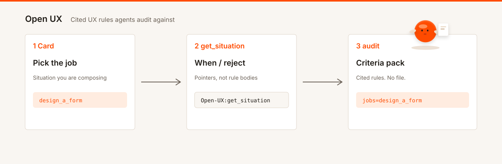

# Open UX



Cited UX rules agents audit against. Open Cards that fit, then get a criteria pack. You decide.

Homepage: [open-ux.dev](https://open-ux.dev)

Do not put “MCP” in the marketplace / plugin title or landing H1.

Logo (Cursor `logo` field): [assets/icon.svg](assets/icon.svg). Listing art: [assets/hero.svg](assets/hero.svg), [assets/offerings.svg](assets/offerings.svg).

## Install

Plugins are not in the public marketplaces yet; install from this GitHub repo. See [SETUP.md](SETUP.md) for keys and MCP.

### Get a key

[open-ux.dev/invite](https://open-ux.dev/invite) → redeem → `uxmcp_…`

### Claude Code

```bash
claude plugin marketplace add 3dyonic/open-ux
claude plugin install open-ux@open-ux
```

Enable the plugin; paste your key when prompted.

### Cursor

Open this repository, enable the Open UX plugin, set **`OPEN_UX_API_KEY`** under **Plugins → Configure**.

Validate: `claude plugin validate . --strict` · `node scripts/validate-cursor-plugin.mjs --strict` (repo root).

Listing submit (maintainers): [Claude](https://platform.claude.com/plugins/submit) · [Cursor](https://cursor.com/marketplace/publish).

Contributors: [`docs/CONTRIBUTING.md`](../../docs/CONTRIBUTING.md).

## Connect

`pip install` the package, or hosted; same tools, same Cards. Package name: `open-ux`. Console script: `open-ux`.

```bash
pip install open-ux
python -m open_ux validate-catalog
python -m open_ux stdio
OPEN_UX_MODE=hosted python -m open_ux http
```

No key; same catalog. Point MCP clients at local stdio, or hosted `https://open-ux.dev/mcp` + `uxmcp_` bearer (`OPEN_UX_API_KEY`) for the shared live catalog. Contributors: clone the repo and `pip install -e "packages/mcp[dev]"`.

## Tools

See [`docs/TOOLS.md`](../../docs/TOOLS.md). Criteria pull: **`Open-UX:pack`**.

- **`suggest_situations`:** `task_text` → full 13-Card map by container. Does not pick or rank.
- **`list_situations`:** Card index; optional `container`. Metadata only.
- **`get_situation`:** One Card (when / reject / leaf counts). Leaf id fails.
- **`pack`:** Cited criteria for `jobs=<card_id>`, `jobs=<leaf_id>`, container alias, or `guideline_ids`; page with `next_offset`. No file, no pass/fail.
- **`get_guideline`:** One full rule body by id.
- **`list_components`** / **`get_component`:** Component index and record. Context helper when `component[]` is on the Card or pack row.

## Offerings (one skill)

Compose, review, map, and cite are jobs in `skills/open-ux`: not extra packages.

- **Compose / review:** compare Cards that fit; `Open-UX:get_situation` (leaf `{ id, count }`), then `Open-UX:pack` with `jobs=`; read envelope reject and row fit; `get_guideline`; `get_component` for control context when `component[]` fits; loop `next_offset`. You decide. No winner Card.
- **Map:** `Open-UX:suggest_situations` when the ask is a vague surface (catalog map). The catalog stays open after a pack.
- **Cite:** `Open-UX:search_guidelines` / `Open-UX:get_guideline`

Commands: `/list` `/get` `/pack`, plus aliases `/forms` `/actions` `/feedback`. Agent pointers: `agents/open-ux.md`.

Agents use **`Open-UX:*` MCP tools**; host fetches catalog data. Optional LLM local: **`open-ux rank-pack`** after pack (`pip install open-ux`); see [`helpers/README.md`](../../helpers/README.md). Contributor CLI/wire: `contributor_wire` in `open-ux helpers list`. Contributor scripts live in `scripts/`: not the skill path.
